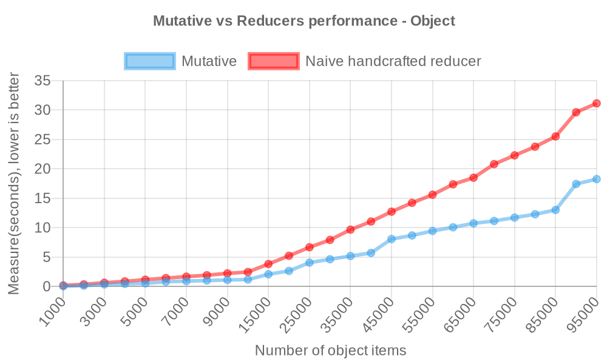
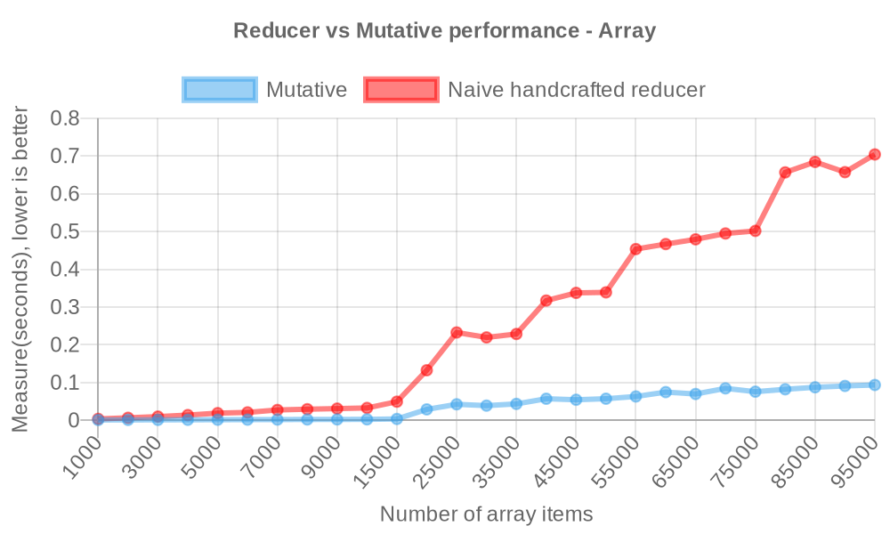
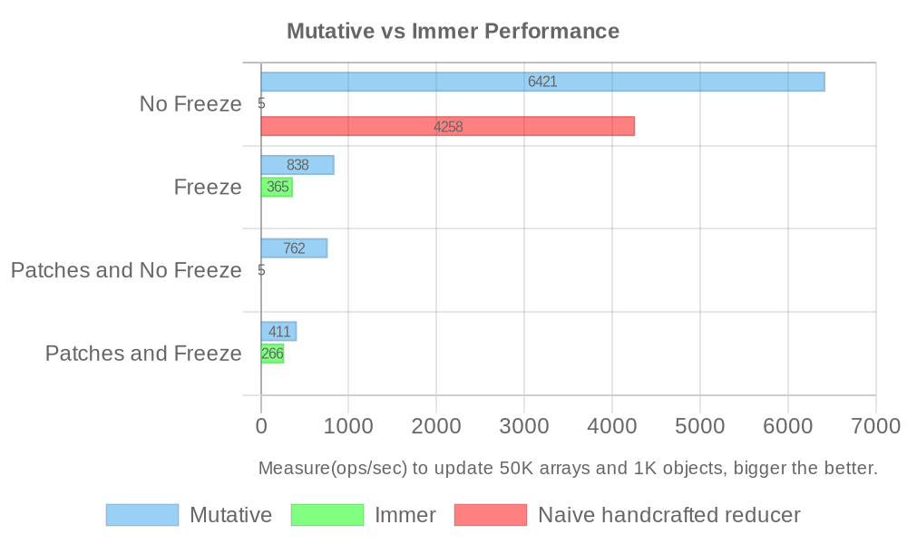

# Mutative

<a href="https://mutative.js.org/" target="_blank"></a>


[](https://coveralls.io/github/unadlib/mutative?branch=main)
[](https://www.npmjs.com/package/mutative)


**Mutative** - A JavaScript library for efficient immutable updates, 2-6x faster than naive handcrafted reducer, and more than 10x faster than Immer.

**Why is Mutative faster than the spread operation(naive handcrafted reducer)?**

The spread operation has performance pitfalls, which can be detailed in the following article:

- <a href="https://www.richsnapp.com/article/2019/06-09-reduce-spread-anti-pattern" target="_blank">The reduce ({...spread}) anti-pattern</a>
- <a href="https://jonlinnell.co.uk/articles/spread-operator-performance?fbclid=IwAR0mElQwz2aOxl8rcsqoYwkcQDlcXcwuyIsTmTAbmyzrarysS8-BC1lSY9k" target="_blank">How slow is the Spread operator in JavaScript?</a>

And Mutative optimization focus on shallow copy optimization, more complete lazy drafts, finalization process optimization, and more.

## Motivation

Writing immutable updates by hand is usually difficult, prone to errors, and cumbersome. Immer helps us write simpler immutable updates with "mutative" logic.

But its performance issue causes a runtime performance overhead. Immer must have auto-freeze enabled by default(Performance will be worse if auto-freeze is disabled), such immutable state with Immer is not common. In scenarios such as cross-processing, remote data transfer, etc., we have to constantly freeze these immutable data.

There are more parts that could be improved, such as better type inference, non-intrusive markup, support for more types of immutability, Safer immutability, [more edge cases](test/immer-non-support.test.ts), and so on.

This is why Mutative was created.

## Mutative vs Naive Handcrafted Reducer Performance

<details>
<summary><b>Mutative vs Reducer benchmark by object:  </b></summary>

- Naive handcrafted reducer

```ts
// baseState type: Record<string, { value: number }>
const state = {
  ...baseState,
  key0: {
    ...baseState.key0,
    value: i,
  },
};
```

- Mutative

```ts
const state = create(baseState, (draft) => {
  draft.key0.value = i;
});
```



> Measure(seconds) to update the 1K-100K items object, lower is better([view source](https://github.com/unadlib/mutative/blob/main/test/performance/benchmark-object.ts)).

</details>

Mutative is up to 2x faster than naive handcrafted reducer for updating immutable objects.

<details>
<summary><b>Mutative vs Reducer benchmark by array: </b></summary>

- Naive handcrafted reducer

```ts
// baseState type: { value: number }[]

// slower 6x than Mutative
const state = [
  { ...baseState[0], value: i },
  ...baseState.slice(1, baseState.length),
];

// slower 2.5x than Mutative
// const state = baseState.map((item, index) =>
//   index === 0 ? { ...item, value: i } : item
// );

// same performance as Mutative
// const state = [...baseState];
// state[0] = { ...baseState[0], value: i };
```

> The actual difference depends on which spread operation syntax you use.

- Mutative

```ts
const state = create(baseState, (draft) => {
  draft[0].value = i;
});
```



> Measure(seconds) to update the 1K-100K items array, lower is better([view source](https://github.com/unadlib/mutative/blob/main/test/performance/benchmark-array.ts)).

</details>

Mutative is up to 6x faster than naive handcrafted reducer for updating immutable arrays.

## Mutative vs Immer Performance

> Mutative passed all of Immer's test cases.

Measure(ops/sec) to update 50K arrays and 1K objects, bigger is better([view source](https://github.com/unadlib/mutative/blob/main/test/performance/benchmark.ts)). [Mutative v1.0.3 vs Immer v10.0.3]



```
Naive handcrafted reducer - No Freeze x 4,476 ops/sec ±0.38% (96 runs sampled)
Mutative - No Freeze x 6,058 ops/sec ±0.91% (90 runs sampled)
Immer - No Freeze x 5.80 ops/sec ±0.34% (19 runs sampled)

Mutative - Freeze x 971 ops/sec ±1.07% (98 runs sampled)
Immer - Freeze x 380 ops/sec ±0.61% (94 runs sampled)

Mutative - Patches and No Freeze x 967 ops/sec ±0.94% (96 runs sampled)
Immer - Patches and No Freeze x 5.83 ops/sec ±0.17% (19 runs sampled)

Mutative - Patches and Freeze x 502 ops/sec ±0.94% (96 runs sampled)
Immer - Patches and Freeze x 278 ops/sec ±0.73% (90 runs sampled)

The fastest method is Mutative - No Freeze
```

Run `yarn benchmark` to measure performance.

> OS: macOS 14.2.1, CPU: Apple M1 Max, Node.js: v20.11.0

Immer relies on auto-freeze to be enabled, if auto-freeze is disabled, Immer will have a huge performance drop and Mutative will have a huge performance lead, especially with large data structures it will have a performance lead of more than 50x.

So if you are using Immer, you will have to enable auto-freeze for performance. Mutative is disabled auto-freeze by default. With the default configuration of both, we can see the 16x performance gap between Mutative (`6,058 ops/sec`) and Immer (`380 ops/sec`).

Overall, Mutative has a huge performance lead over Immer in [more performance testing scenarios](https://github.com/unadlib/mutative/tree/main/test/performance). Run `yarn performance` to get all the performance results locally.

## Features and Benefits

- **Mutation makes immutable updates** - Immutable data structures supporting objects, arrays, Sets and Maps.
- **High performance** - 10x faster than immer by default, even faster than naive handcrafted reducer.
- **Optional freezing state** - No freezing of immutable data by default.
- **Support for JSON Patch** - Full compliance with JSON Patch specification.
- **Custom shallow copy** - Support for more types of immutable data.
- **Support mark for immutable and mutable data** - Allows for non-invasive marking.
- **Safer mutable data access in strict mode** - It brings more secure immutable updates.
- **Support for reducer** - Support reducer function and any other immutable state library.

## Difference between Mutative and Immer

|                                       | Mutative | Immer |
| :------------------------------------ | -------: | :---: |
| Custom shallow copy                   |       ✅ |  ❌   |
| Strict mode                           |       ✅ |  ❌   |
| No data freeze by default             |       ✅ |  ❌   |
| Non-invasive marking                  |       ✅ |  ❌   |
| Complete freeze data                  |       ✅ |  ❌   |
| Non-global config                     |       ✅ |  ❌   |
| async draft function                  |       ✅ |  ❌   |
| Fully compatible with JSON Patch spec |       ✅ |  ❌   |

Mutative has fewer bugs such as accidental draft escapes than Immer, [view details](https://github.com/unadlib/mutative/blob/main/test/immer-non-support.test.ts).

## Installation

Yarn

```sh
yarn add mutative
```

NPM

```sh
npm install mutative
```

CDN

- Unpkg: `<script src="https://unpkg.com/mutative"></script>`
- JSDelivr: `<script src="https://cdn.jsdelivr.net/npm/mutative"></script>`

## Usage

```ts
import { create } from 'mutative';

const baseState = {
  foo: 'bar',
  list: [{ text: 'coding' }],
};

const state = create(baseState, (draft) => {
  draft.list.push({ text: 'learning' });
});

expect(state).not.toBe(baseState);
expect(state.list).not.toBe(baseState.list);
```

`create(baseState, (draft) => void, options?: Options): newState`

The first argument of `create()` is the base state. Mutative drafts it and passes it to the arguments of the draft function, and performs the draft mutation until the draft function finishes, then Mutative will finalize it and produce the new state.

Use `create()` for more advanced features by [setting `options`](#createstate-fn-options).

## APIs

- [`create()`](#create)
- [`apply()`](#apply)
- [`current()`](#current)
- [`original()`](#original)
- [`unsafe()`](#unsafe)
- [`isDraft()`](#isdraft)
- [`isDraftable()`](#isdraftable)
- [`rawReturn()`](#rawreturn)
- [`makeCreator()`](#makecreator)
- [`markSimpleObject()`](#marksimpleobject)

### `create()`

Use `create()` for draft mutation to get a new state, which also supports currying.

```ts
import { create } from 'mutative';

const baseState = {
  foo: 'bar',
  list: [{ text: 'todo' }],
};

const state = create(baseState, (draft) => {
  draft.foo = 'foobar';
  draft.list.push({ text: 'learning' });
});
```

In this basic example, the changes to the draft are 'mutative' within the draft callback, and `create()` is finally executed with a new immutable state.

#### `create(state, fn, options)`

> Then options is optional.

- strict - `boolean`, the default is false.

  > Forbid accessing non-draftable values in strict mode(unless using [unsafe()](#unsafe)).

  > When strict mode is enabled, mutable data can only be accessed using [`unsafe()`](#unsafe).

  > **It is recommended to enable `strict` in development mode and disable `strict` in production mode.** This will ensure safe explicit returns and also keep good performance in the production build. If the value that does not mix any current draft or is `undefined` is returned, then use [rawReturn()](#rawreturn).

- enablePatches - `boolean | { pathAsArray?: boolean; arrayLengthAssignment?: boolean; }`, the default is false.

  > Enable patch, and return the patches/inversePatches.

  > If you need to set the shape of the generated patch in more detail, then you can set `pathAsArray` and `arrayLengthAssignment`。`pathAsArray` default value is `true`, if it's `true`, the path will be an array, otherwise it is a string; `arrayLengthAssignment` default value is `true`, if it's `true`, the array length will be included in the patches, otherwise no include array length(**NOTE**: If `arrayLengthAssignment` is `false`, it is fully compatible with JSON Patch spec, but it may have additional performance loss), [view related discussions](https://github.com/unadlib/mutative/issues/6).

- enableAutoFreeze - `boolean`, the default is false.

  > Enable autoFreeze, and return frozen state, and enable circular reference checking only in `development` mode.

- mark - `(target) => ('mutable'|'immutable'|function) | (target) => ('mutable'|'immutable'|function)[]`
  > Set a mark to determine if the value is mutable or if an instance is an immutable, and it can also return a shallow copy function(`AutoFreeze` and `Patches` should both be disabled, Some patches operation might not be equivalent).
  > When the mark function is (target) => 'immutable', it means all the objects in the state structure are immutable. In this specific case, you can totally turn on `AutoFreeze` and `Patches`.
  > `mark` supports multiple marks, and the marks are executed in order, and the first mark that returns a value will be used.

#### `create()` - Currying

- create `draft`

```ts
const [draft, finalize] = create(baseState);
draft.foobar.bar = 'baz';
const state = finalize();
```

> Support set options such as `const [draft, finalize] = create(baseState, { enableAutoFreeze: true });`

- create `producer`

```ts
const produce = create((draft) => {
  draft.foobar.bar = 'baz';
});
const state = produce(baseState);
```

> Also support set options such as `const produce = create((draft) => {}, { enableAutoFreeze: true });`

### `apply()`

Use `apply()` for applying patches to get the new state.

```ts
import { create, apply } from 'mutative';

const baseState = {
  foo: 'bar',
  list: [{ text: 'todo' }],
};

const [state, patches, inversePatches] = create(
  baseState,
  (draft) => {
    draft.foo = 'foobar';
    draft.list.push({ text: 'learning' });
  },
  {
    enablePatches: true,
  }
);

const nextState = apply(baseState, patches);
expect(nextState).toEqual(state);
const prevState = apply(state, inversePatches);
expect(prevState).toEqual(baseState);
```

### `current()`

Get the current value from a draft.

```ts
const baseState = {
  foo: 'bar',
  list: [{ text: 'todo' }],
};

const state = create(baseState, (draft) => {
  draft.foo = 'foobar';
  draft.list.push({ text: 'learning' });
  expect(current(draft.list)).toEqual([{ text: 'todo' }, { text: 'learning' }]);
});
```

### `original()`

Get the original value from a draft.

```ts
const baseState = {
  foo: 'bar',
  list: [{ text: 'todo' }],
};

const state = create(baseState, (draft) => {
  draft.foo = 'foobar';
  draft.list.push({ text: 'learning' });
  expect(original(draft.list)).toEqual([{ text: 'todo' }]);
});
```

### `unsafe()`

When strict mode is enabled, mutable data can only be accessed using `unsafe()`.

```ts
const baseState = {
  list: [],
  date: new Date(),
};

const state = create(
  baseState,
  (draft) => {
    unsafe(() => {
      draft.date.setFullYear(2000);
    });
    // or return the mutable data:
    // const date = unsafe(() => draft.date);
  },
  {
    strict: true,
  }
);
```

### `isDraft()`

Check if a value is a draft.

```ts
const baseState = {
  date: new Date(),
  list: [{ text: 'todo' }],
};

const state = create(baseState, (draft) => {
  expect(isDraft(draft.date)).toBeFalsy();
  expect(isDraft(draft.list)).toBeTruthy();
});
```

### `isDraftable()`

Check if a value is draftable

```ts
const baseState = {
  date: new Date(),
  list: [{ text: 'todo' }],
};

expect(isDraftable(baseState.date)).toBeFalsy();
expect(isDraftable(baseState.list)).toBeTruthy();
```

> You can set a mark to determine if the value is draftable, and the mark function should be the same as passing in `create()` mark option.

### `rawReturn()`

For return values that do not contain any drafts, you can use `rawReturn()` to wrap this return value to improve performance. It ensure that the return value is only returned explicitly.

```ts
const baseState = { id: 'test' };
const state = create(baseState as { id: string } | undefined, (draft) => {
  return rawReturn(undefined);
});
expect(state).toBe(undefined);
```

> If the return value mixes drafts, you should not use `rawReturn()`.

```ts
const baseState = { a: 1, b: { c: 1 } };
const state = create(baseState, (draft) => {
  if (draft.b.c === 1) {
    return {
      ...draft,
      a: 2,
    };
  }
});
expect(state).toEqual({ a: 2, b: { c: 1 } });
expect(isDraft(state.b)).toBeFalsy();
```

If you use `rawReturn()`, we recommend that you enable `strict` mode in development.

```ts
const baseState = { a: 1, b: { c: 1 } };
const state = create(
  baseState,
  (draft) => {
    if (draft.b.c === 1) {
      return rawReturn({
        ...draft,
        a: 2,
      });
    }
  },
  {
    strict: true,
  }
);
// it will warn `The return value contains drafts, please don't use 'rawReturn()' to wrap the return value.` in strict mode.
expect(state).toEqual({ a: 2, b: { c: 1 } });
expect(isDraft(state.b)).toBeFalsy();
```

### `makeCreator()`

`makeCreator()` only takes [options](#createstate-fn-options) as the first argument, resulting in a custom `create()` function.

```ts
const baseState = {
  foo: {
    bar: 'str',
  },
};

const create = makeCreator({
  enablePatches: true,
});

const [state, patches, inversePatches] = create(baseState, (draft) => {
  draft.foo.bar = 'new str';
});
```

### `markSimpleObject()`

`markSimpleObject()` is a mark function that marks all objects as immutable.

```ts
const baseState = {
  foo: {
    bar: 'str',
  },
  simpleObject: Object.create(null),
};

const state = create(
  baseState,
  (draft) => {
    draft.foo.bar = 'new str';
    draft.simpleObject.a = 'a';
  },
  {
    mark: markSimpleObject,
  }
);

expect(state.simpleObject).not.toBe(baseState.simpleObject);
```

[View more API docs](./docs/README.md).

## Using TypeScript

- `castDraft()`
- `castImmutable()`
- `Draft<T>`
- `Immutable<T>`
- `Patches`
- `Patch`
- `Options<O, F>`

## Integration with React

- [use-mutative](https://github.com/unadlib/use-mutative)

## FAQs

- I'm already using Immer, can I migrate smoothly to Mutative?

Yes. Unless you have to be compatible with Internet Explorer, Mutative supports almost all of Immer features, and you can easily migrate from Immer to Mutative.

> Migration is also not possible for React Native that does not support Proxy. React Native uses a new JS engine during refactoring - Hermes, and it (if < v0.59 or when using the Hermes engine on React Native < v0.64) does [not support Proxy on Android](https://github.com/facebook/hermes/issues/33), but [React Native v0.64 with the Hermes engine support Proxy](https://reactnative.dev/blog/2021/03/12/version-0.64#hermes-with-proxy-support).

- Can Mutative be integrated with Redux?

Yes. Mutative supports return values for reducer, and `redux-toolkit` is considering support for [configurable `produce()`](https://github.com/reduxjs/redux-toolkit/pull/3074).

## Migration from Immer to Mutative

> [mutative-compat](https://github.com/exuanbo/mutative-compat) - Mutative wrapper with full Immer API compatibility, you can use it to quickly migrate from Immer to Mutative.

1. `produce()` -> `create()`

Mutative auto freezing option is disabled by default, Immer auto freezing option is enabled by default (if disabled, Immer performance will have a more huge drop).

> You need to check if auto freezing has any impact on your project. If it depends on auto freezing, you can enable it yourself in Mutative.

```ts
import produce from 'immer';

const nextState = produce(baseState, (draft) => {
  draft[1].done = true;
  draft.push({ title: 'something' });
});
```

Use Mutative

```ts
import { create } from 'mutative';

const nextState = create(baseState, (draft) => {
  draft[1].done = true;
  draft.push({ title: 'something' });
});
```

2. `Patches`

```ts
import { produceWithPatches, applyPatches } from 'immer';

enablePatches();

const baseState = {
  age: 33,
};

const [nextState, patches, inversePatches] = produceWithPatches(
  baseState,
  (draft) => {
    draft.age++;
  }
);

const state = applyPatches(nextState, inversePatches);

expect(state).toEqual(baseState);
```

Use Mutative

```ts
import { create, apply } from 'mutative';

const baseState = {
  age: 33,
};

const [nextState, patches, inversePatches] = create(
  baseState,
  (draft) => {
    draft.age++;
  },
  {
    enablePatches: true,
  }
);

const state = apply(nextState, inversePatches);

expect(state).toEqual(baseState);
```

3. Return `undefined`

```ts
import produce, { nothing } from 'immer';

const nextState = produce(baseState, (draft) => {
  return nothing;
});
```

Use Mutative

```ts
import { create, rawReturn } from 'mutative';

const nextState = create(baseState, (draft) => {
  return rawReturn(undefined);
});
```

## Contributing

Mutative goal is to provide efficient and immutable updates. The focus is on performance improvements and providing better APIs for better development experiences. We are still working on it and welcome PRs that may help Mutative.

Development Workflow:

- Clone Mutative repo.
- Run `yarn install` to install all the dependencies.
- Run `yarn prettier` to format the code.
- `yarn test --watch` runs an interactive test watcher.
- Run `yarn commit` to make a git commit.

## License

Mutative is [MIT licensed](https://github.com/unadlib/mutative/blob/main/LICENSE).
