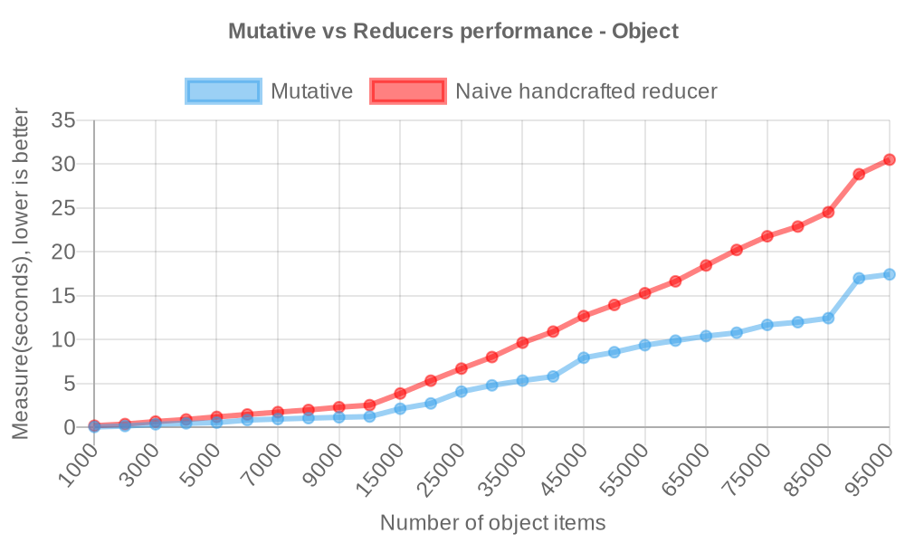
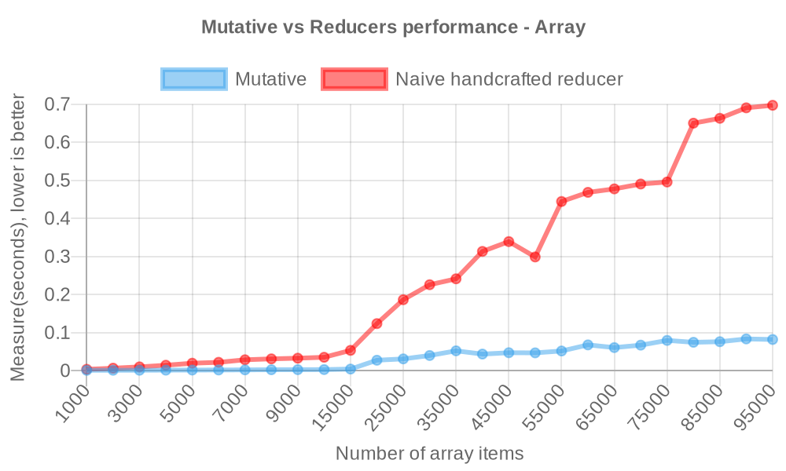
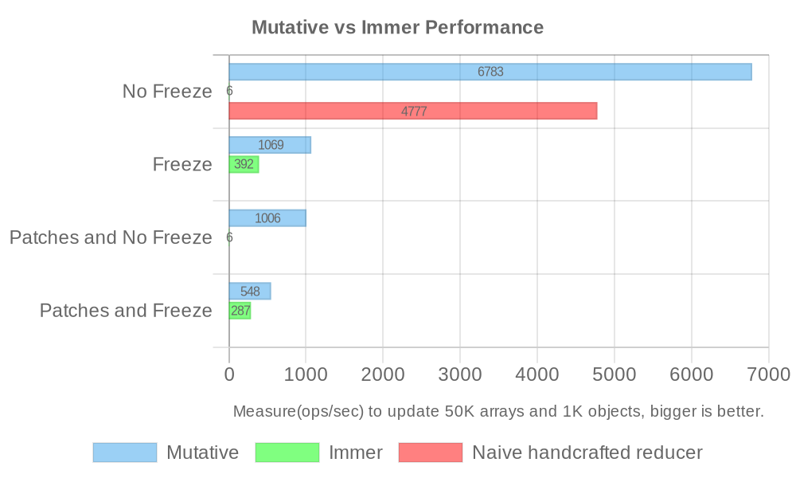

In the world of JavaScript development, managing immutable state efficiently is a cornerstone for high-performance applications. Today, we are excited to introduce Mutative 1.0, a JavaScript library that redefines the way we handle immutable updates. With performance that is 2-6x faster than naive handcrafted reducers and over 10x faster than Immer, Mutative 1.0 is set to transform our approach to immutable state management and make it more efficient.

Repository: [https://github.com/unadlib/mutative](https://github.com/unadlib/mutative)

## Key Features and Benefits

Mutative brings a suite of features designed to optimize performance and flexibility:

- **High Performance**: At its core, Mutative is engineered for speed. It excels in scenarios involving large data structures, making it an ideal choice for complex applications.
- **Immutable Updates with Ease**: Supporting a range of data structures including objects, arrays, Sets, Maps, and more customizable types, Mutative ensures that immutable updates are not just efficient but also straightforward to implement.
- **Flexible Configuration**: The library offers optional freezing of immutable data, strict mode and supports the JSON Patch standard, providing developers with the flexibility to tailor it to their specific needs.

## Performance

### Reducer by object

- Naive handcrafted reducer

```ts
// baseState type: Record<string, { value: number }>
const state = {
  ...baseState,
  key0: {
    ...baseState.key0,
    value: i,
  },
};
```

- Mutative

```ts
const state = create(baseState, (draft) => {
  draft.key0.value = i;
});
```



> Measure(seconds) to update the 1K-100K items object, lower is better([view source](https://github.com/unadlib/mutative/blob/main/test/performance/benchmark-object.ts)).


**Mutative is up to `2x` faster than naive handcrafted reducer for updating immutable objects.**

### Reducer by array

- Naive handcrafted reducer

```ts
// baseState type: { value: number }[]
const state = [
  { ...baseState[0], value: i },
  ...baseState.slice(1, baseState.length),
];
```

- Mutative

```ts
const state = create(baseState, (draft) => {
  draft[0].value = i;
});
```



> Measure(seconds) to update the 1K-100K items array, lower is better([view source](https://github.com/unadlib/mutative/blob/main/test/performance/benchmark-array.ts)).

**Mutative is up to `6x` faster than naive handcrafted reducer for updating immutable arrays.**


## Mutative vs Immer Performance

> Mutative passed all of Immer's test cases.

Measure(ops/sec) to update 50K arrays and 1K objects, bigger is better([view source](https://github.com/unadlib/mutative/blob/main/test/performance/benchmark.ts)). [Mutative v1.0.4 vs Immer v10.0.4]



```
Naive handcrafted reducer - No Freeze x 4,450 ops/sec ±0.36% (96 runs sampled)
Mutative - No Freeze x 6,137 ops/sec ±1.15% (89 runs sampled)
Immer - No Freeze x 5.27 ops/sec ±0.65% (18 runs sampled)

Mutative - Freeze x 960 ops/sec ±1.42% (95 runs sampled)
Immer - Freeze x 378 ops/sec ±0.70% (93 runs sampled)

Mutative - Patches and No Freeze x 960 ops/sec ±1.32% (97 runs sampled)
Immer - Patches and No Freeze x 5.27 ops/sec ±0.69% (18 runs sampled)

Mutative - Patches and Freeze x 493 ops/sec ±1.40% (94 runs sampled)
Immer - Patches and Freeze x 275 ops/sec ±0.62% (89 runs sampled)

The fastest method is Mutative - No Freeze
```

Run `yarn benchmark` to measure performance.

> OS: macOS 14.2.1, CPU: Apple M1 Max, Node.js: v20.11.0

Immer relies on auto-freeze to be enabled, if auto-freeze is disabled, Immer will have a huge performance drop and Mutative will have a huge performance lead, especially with large data structures it will have a performance lead of more than 50x.

So if you are using Immer, you will have to enable auto-freeze for performance. Mutative is disabled auto-freeze by default. With the default configuration of both, we can see the 16x performance gap between Mutative (`6,058 ops/sec`) and Immer (`380 ops/sec`).

Overall, Mutative has a huge performance lead over Immer in [more performance testing scenarios](https://github.com/unadlib/mutative/tree/main/test/performance).


## Comparison with Immer

While Immer has been a popular choice for handling immutable data, Mutative 1.0 takes it a step further, and Mutative is over 10x faster than Immer. It not only matches all of Immer's test cases but also introduces additional features such as custom shallow copy, strict mode, and a default setting that does not freeze data. These enhancements make Mutative more efficient, especially in handling large-scale applications. Here’s a quick comparison of the two libraries:

|                                       | Mutative | Immer |
| :------------------------------------ | -------: | :---: |
| Custom shallow copy                   |       ✅ |  ❌   |
| Strict mode                           |       ✅ |  ❌   |
| No data freeze by default             |       ✅ |  ❌   |
| Non-invasive marking                  |       ✅ |  ❌   |
| Complete freeze data                  |       ✅ |  ❌   |
| Non-global config                     |       ✅ |  ❌   |
| async draft function                  |       ✅ |  ❌   |
| Fully compatible with JSON Patch spec |       ✅ |  ❌   |

Mutative has fewer bugs such as accidental draft escapes than Immer, [view details](https://github.com/unadlib/mutative/blob/main/test/immer-non-support.test.ts).

## Getting Started

Integrating Mutative into your JavaScript projects is straightforward. You can install it using Yarn or NPM, and its API is intuitive and easy to grasp. Here’s a quick start example:

1. Install Mutative using Yarn or NPM:

```bash
yarn add mutative
```

2. Import the `create` function from Mutative and use it to create a new immutable state:

```javascript
import { create } from 'mutative';

const baseState = {
  foo: 'bar',
  list: [{ text: 'coding' }],
};

const state = create(baseState, (draft) => {
  draft.list.push({ text: 'learning' });
});

expect(state).not.toBe(baseState);
expect(state.list).not.toBe(baseState.list);
```

This simple code snippet demonstrates the ease with which you can manage immutable state using Mutative.

## Conclusion

As we unveil Mutative 1.0, we're not just releasing a new library; we're inviting JavaScript developers to step into a future where state management is no longer a bottleneck but a catalyst for performance and innovation. Mutative 1.0 stands as a testament to what modern JavaScript can achieve - a blend of speed, efficiency, and ease of use that elevates coding from a task to an art.

This library is more than a tool; it's a paradigm shift in how we approach immutable updates. With its unparalleled performance, Mutative 1.0 is poised to redefine best practices in JavaScript development, making cumbersome state management a thing of the past. It's an invitation to developers to push the boundaries of what's possible, to build applications that are not just functional but phenomenally fast and responsive.

As the JavaScript landscape continues to evolve, Mutative 1.0 will undoubtedly play a pivotal role in shaping the future of state management. We encourage the community to explore its potential, to integrate it into their projects, and to contribute to its growth. Together, we can drive the evolution of JavaScript development, making our applications not just faster, but smarter, and more intuitive than ever before.

Join us in embracing the future with Mutative 1.0 - where efficiency meets innovation, and where every line of code brings us closer to the zenith of JavaScript potential.
