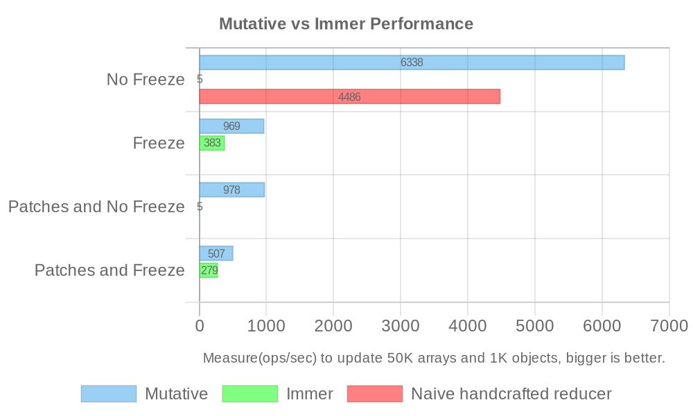

# Comparison with Immer

Mutative is a high-performance immutable update library, and Immer is a popular immutable update library. This page compares the differences between Mutative and Immer.

## Difference between Mutative and Immer

|                                       | Mutative | Immer |
| :------------------------------------ | -------: | :---: |
| Custom shallow copy                   |       ✅ |  ❌   |
| Strict mode                           |       ✅ |  ❌   |
| No data freeze by default             |       ✅ |  ❌   |
| Non-invasive marking                  |       ✅ |  ❌   |
| Complete freeze data                  |       ✅ |  ❌   |
| Non-global config                     |       ✅ |  ❌   |
| async draft function                  |       ✅ |  ❌   |
| Fully compatible with JSON Patch spec |       ✅ |  ❌   |

Mutative has fewer bugs such as accidental draft escapes than Immer, [view details](https://github.com/unadlib/mutative/blob/main/test/immer-non-support.test.ts).

## Mutative vs Immer Performance

> Mutative passed all of Immer's test cases.

Measure(ops/sec) to update 50K arrays and 1K objects, bigger is better([view source](https://github.com/unadlib/mutative/blob/main/test/performance/benchmark.ts)). [Mutative v1.0.10 vs Immer v10.1.1]



```
Naive handcrafted reducer - No Freeze x 4,439 ops/sec ±0.65% (98 runs sampled)
Mutative - No Freeze x 6,300 ops/sec ±1.19% (94 runs sampled)
Immer - No Freeze x 5.26 ops/sec ±0.59% (18 runs sampled)

Mutative - Freeze x 937 ops/sec ±1.25% (95 runs sampled)
Immer - Freeze x 378 ops/sec ±0.66% (93 runs sampled)

Mutative - Patches and No Freeze x 975 ops/sec ±0.17% (99 runs sampled)
Immer - Patches and No Freeze x 5.29 ops/sec ±0.30% (18 runs sampled)

Mutative - Patches and Freeze x 512 ops/sec ±0.85% (98 runs sampled)
Immer - Patches and Freeze x 278 ops/sec ±0.57% (90 runs sampled)

The fastest method is Mutative - No Freeze
```

Run `yarn benchmark` to measure performance.

> OS: macOS 14.2.1, CPU: Apple M1 Max, Node.js: v20.11.0

Immer relies on auto-freeze to be enabled, if auto-freeze is disabled, Immer will have a huge performance drop and Mutative will have a huge performance lead, especially with large data structures it will have a performance lead of more than 50x.

So if you are using Immer, you will have to enable auto-freeze for performance. Mutative is disabled auto-freeze by default. With the default configuration of both, we can see the 16x performance gap between Mutative (`6,300 ops/sec`) and Immer (`378 ops/sec`).

Overall, Mutative has a huge performance lead over Immer in [more performance testing scenarios](https://github.com/unadlib/mutative/tree/main/test/performance). Run `yarn performance` to get all the performance results locally.

