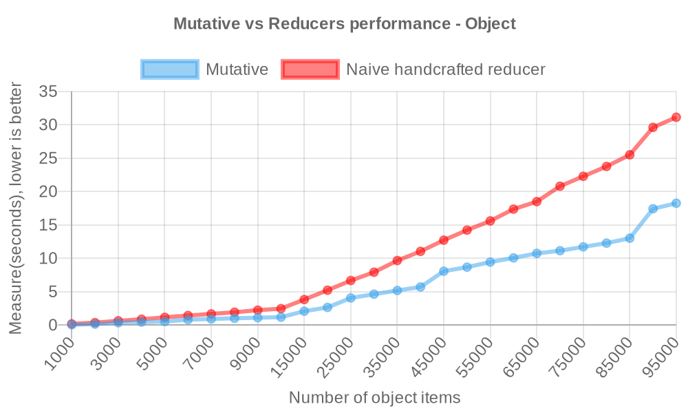
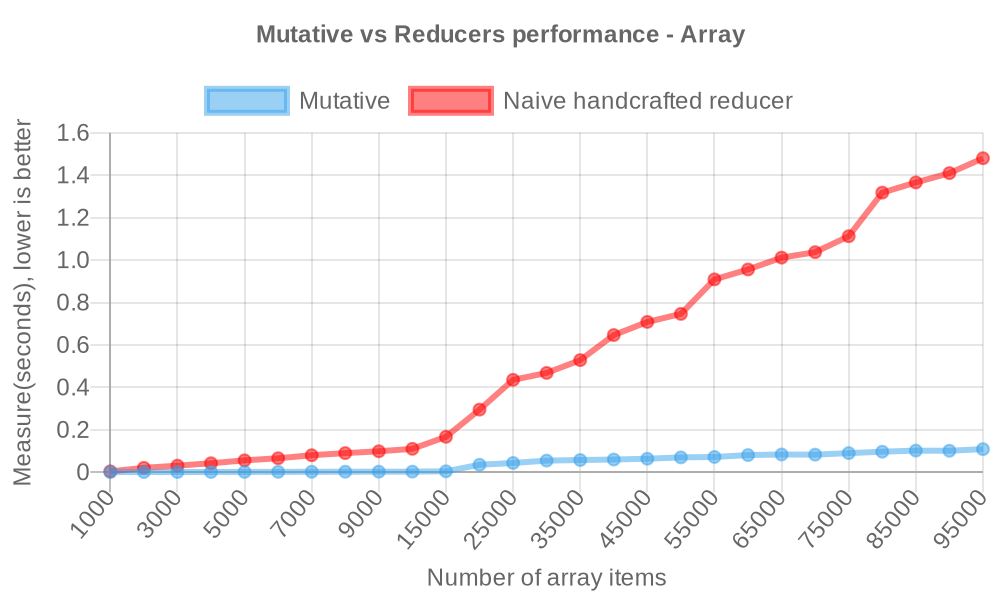

# Performance

Mutative is a high-performance immutable data structure library, it is up to `2x-6x` faster than naive handcrafted reducer and up to `16x` faster than Immer.

## Mutative vs Reducer Performance

### Reducer by object

- Naive handcrafted reducer

```ts
// baseState type: Record<string, { value: number }>
const state = {
  ...baseState,
  key0: {
    ...baseState.key0,
    value: i,
  },
};
```

- Mutative

```ts
const state = create(baseState, (draft) => {
  draft.key0.value = i;
});
```



> Measure(seconds) to update the 1K-100K items object, lower is better([view source](https://github.com/unadlib/mutative/blob/main/test/performance/benchmark-object.ts)).


**Mutative is up to `2x` faster than naive handcrafted reducer for updating immutable objects.**

### Reducer by array

- Naive handcrafted reducer

```ts
// baseState type: { value: number }[]
const state = [
  { ...baseState[0], value: i },
  ...baseState.slice(1, baseState.length),
];
```

- Mutative

```ts
const state = create(baseState, (draft) => {
  draft[0].value = i;
});
```



> Measure(seconds) to update the 1K-100K items array, lower is better([view source](https://github.com/unadlib/mutative/blob/main/test/performance/benchmark-array.ts)).

**Mutative is up to `6x` faster than naive handcrafted reducer for updating immutable arrays.**


## Mutative vs Immer Performance

> Mutative passed all of Immer's test cases.

Measure(ops/sec) to update 50K arrays and 1K objects, bigger is better([view source](https://github.com/unadlib/mutative/blob/main/test/performance/benchmark.ts)). [Mutative v1.0.5 vs Immer v10.0.4]


```
Naive handcrafted reducer - No Freeze x 4,442 ops/sec ±0.49% (94 runs sampled)
Mutative - No Freeze x 6,101 ops/sec ±1.26% (88 runs sampled)
Immer - No Freeze x 5.20 ops/sec ±0.68% (17 runs sampled)

Mutative - Freeze x 946 ops/sec ±1.36% (92 runs sampled)
Immer - Freeze x 376 ops/sec ±1.10% (93 runs sampled)

Mutative - Patches and No Freeze x 963 ops/sec ±1.14% (96 runs sampled)
Immer - Patches and No Freeze x 5.32 ops/sec ±0.21% (18 runs sampled)

Mutative - Patches and Freeze x 501 ops/sec ±1.24% (93 runs sampled)
Immer - Patches and Freeze x 272 ops/sec ±0.61% (88 runs sampled)

The fastest method is Mutative - No Freeze
```

Run `yarn benchmark` to measure performance.

> OS: macOS 14.2.1, CPU: Apple M1 Max, Node.js: v20.11.0

Immer relies on auto-freeze to be enabled, if auto-freeze is disabled, Immer will have a huge performance drop and Mutative will have a huge performance lead, especially with large data structures it will have a performance lead of more than 50x.

So if you are using Immer, you will have to enable auto-freeze for performance. Mutative is disabled auto-freeze by default. With the default configuration of both, we can see the 16x performance gap between Mutative (`6,058 ops/sec`) and Immer (`380 ops/sec`).

Overall, Mutative has a huge performance lead over Immer in [more performance testing scenarios](https://github.com/unadlib/mutative/tree/main/test/performance). Run `yarn performance` to get all the performance results locally.
